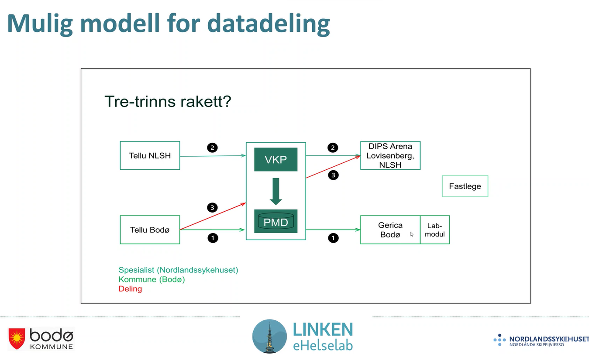

# Møte 22 i FHIR fagforum

* Dato: 2024-02-07
* Klokkeslett: 1300-1500
* 67 personer innom møtet virtuelt og 5 tilstede i møterommet.

FHIR fagforum (FFF) er et åpent forum om bruk og implementering av HL7 FHIR i Norge. FFF er åpent for alle.

## Agenda: Observation og målinger on FHIR, VKP, Pasientens prøvesvar og HSØ PHGateway

1. Introduksjon, jus og ulike FHIR profiler/prosjekter på området, Thomas T Rosenlund, Helsedirektoratet (10 min)
2. Info fra HL7 Norge, Øyvind Aassve, Sykehuspartner (5 min)
3. Behov for samhandling fra Bodø kommune og Nordlandssykehuset, Vibeke Tellmann fra Bodø kommune og Merete Johansen fra Nordlandssykehuset (30 min)
4. Velferdsteknologisk knutepunkt og Pasientens måledata, Jon Nordahl Didriksen NHN, (30 min)
5. Personal Health Gateway og internasjonale IG'er på MTU, Øyvind Aassve, Sykehuspartner (30 min)
6. Diskusjon og spørsmål (15 min)

## Presentasjoner

* [FHIR fagforum intro nr 22 og profiler og jus ](../docs/FHIR-faglig-forum/presentasjon/2024-02-07-FHIR-fagforum-22.pdf)
* [Behov for samhandling fra Bodø kommune og Nordlandssykehuset](../docs/FHIR-faglig-forum/presentasjon/2024-02-07-Presentasjon-behov-bodo.pptx.pdf)

## Introduksjon og HL7 Norge info

Første europeiske WGM arrangert januar 2024.  

* FNs e-health uke
* no-basis-Auditevent workshop
* Pågående aktiviteter

## Behov for samhandling, Bodø og Nordlandssykehuset

Innovasjonsfokus i forbindelse med DHO i Bodø og sykehuset.

* Hva tenker klinikerne om involverte aktører/roller og hvordan tjenesten bør henge sammen for DHO.
* Det er en mangel av kommunikasjon mellom kommune, fastlege og spesialist.
* Målet med DHO er blant annet å unngå at pasienten skal være bærer av informasjon mellom virksomhetene som er involvert.
* Linken eHelselab, eies av Bodø og Nordlandssykehuset.
  * testing, utvikling av velferdsteknologi og kommune og sykehus.
  * Korr vanskelig kan det vær?!?
* Sørge for at det er forståelse av informasjon om 
* Nå er DHO i spredningsfase, krever mye av systemene for å dele data mellom alle aktørene
* Kommunen har egen tjeneste for å følge opp pasientene, har en regional modell for hvordan dette skal skje.
* Bodø: Bruker VKP mellom Tellu og Gerica - for å dekke journalplikten i Bodø kommune.
* Nordlandssykehuset: hva er behovet hos spesialist.
  * Stor nytte av å kunne se informasjonen fra pasienten.
  * Manglende integrasjon mellom virksomhetene gjør det vanskelig å bredde bruk av DHO i sykehuset.
  * Tre silosystemer i drift i sykehuset idag.
    * Kaiku - kreftpasienter - ingen dataflyt mot andre systemer på sykehuset (DIPS)
    * Tellu - dialysepasienter - hjemmedialyse
    * Checkware - sykehus pasienter - spørreskjema
    * Sykehuset trenger flere systemer for å følge opp pasientene.
  * RPA - Nora flytter data og dekker opp for manglende integrasjoner mellom systemer.
  * Flytte data fra Tellu via DHO løsning, via VKP og inn i DIPS, hvordan kan vi skalere dette?
  * Kommunale behov
    * Vil ha tilgang til målinger i en periode
    * Vil kunne gjøre oppslag i målinger.
    * Trender på målinger er nyttig
    * Trenger å dekke journalføringsplikten.
    * DHO handler om mye mer enn målinger, skjemabesvarelser er viktige for å fange opp omstendighetene for målingene.
    * Stort behov for deling av behandlingsplaner, det blir mange ulike planer (en i hver virksomhet).
  * Mulig modell for datadeling via VKP
    * 
  * Informasjonen må også kunne vises på en hensiktsmessig måte i journalsystemet, DIPS.
  * DHO Nord spredningsprosjektet
    * Hva trengs på tvers for å få til samarbeid på tvers av virksomhetene.
    * Pilot i Nordlanssykehuet med noen kommuner i vesterålen, skal bruke samme DHO system en periode.
      * Er ikke nødvendigvis løsningen, men gir mye informasjon om hva som er behovet.
  * DIPS - DHO-PAS
    * DHO modul i DIPS under utvikling lanseres i 2024.
    * Kjernesystemet må kunne håndtere DHO.
    * Prototype av DIPS DHO PAS - sette opp ulike typer DHO løsninger i Helsenord.
    * Ulike typer DHO tjenester som serves av ulike poster på sykehuset.
    * AUTOMATISK koding og rapportering - 
* Målbildet for deling virker ganske enkelt ved bruk  

### Spørsmål: Er målbildet av alle løsningene kontinuerlig sender måledata til DIPS? Spørre om data etter behov?

* Ønsker ikke et sugerør fra måledata til DIPS, men vil nok ha varsler om unormale målinger på en måte. Ulike DHO-leverandører presenterer data bedre enn DIPS.
* Ønsker å kunne spørre etter data ved behov.

### Spørsmål: Totaloversikten i DIPS og kunne hente utfyllende data ved behov, men DIPS er masteroversikten over data på sykehus.

* Sykehuset ønsker noe sånt, akuttmottaket bør vite om data som sykehuset har samlet inn om pasienten.

## Velferdsteknologisk knutepunkt og Pasientens måledata

Behov for målinger via en DHO løsninger, mange strukturerte data som samles inn i DHO systemene i kommunen (typisk kommunen). Det er en kløft mellom DHO system og andre systemer i kommunen og systemer i andre virksomheter.

* VKP brua skal koble datakilden DHO til andre systemer internt
* PMD brua skal koble datakilden DHO til andre systemer eksternt
* Pasientens måledata skal gjøre data tilgjengelig for eksterne.
  * Gir mulighet for å spørre
* De som har VKP integrasjon kan bruke eksisterende VKP integrasjon for å tilgjengeliggjøre data til eksterne kilder.
* Tillitsrammeverket skal sikre at de som har tjenstlig behov og lovlig tilgang får tilgang via API'ene som tilbys.
* Tekstlig journalføring, lagre måledata i egen EPJ og dele data til eksterne
  * Det eksisterer flere behov knyttet til Retinascreening og EHG for eksempel.
* Alle de eksterne API'ene som NHN tilbyr snakker FHIR.
  * Integrasjon mot intern EPJ er litt FHIR, men mye proprietært.
* Journalføring DHO målinger som Observations
* Skjemabesvarelser i QuestionnaireResponse
* Mål med standardisering
  * Gjør det enkelt for leverandører
  * Unngå spesialtilpasninger
  * Enkelt å utvide med nye typer målinger
  * Gjenbruk av byggeklosser og standarder.
* Informasjonbehov som det er behov for å dele.
  * måling, type måling, enhet, tid og device.
  * pasient, terskelverdier, vurdering vav måling, notat til måling, ansvarlig organisasjon, tjeneste/situasjon og metode.
* Typer av målinger både LOINC og SNOMED.
  * LOINC og SNOMED mapping
  * 8480-6 for systolisk blodtrykk - hvordan mappes det til et av de 24 begrepene for systolisk i SNOMED?
* Profiler - VKPObservation
  * Har ikke gjort mange tilpasninger som hindrer oss i å tilpasse oss norske basisprofiler.
  * Bør mest mulig bruke basisprofiler.
  * Informasjonbehovet blir ikke endret av dette.
* Erfaringer om måledata og bruk av observation.
  * Status er at VKP er benyttet for intern jorunalføring i Oslo, Bodø og testing i Nordlandssykehuset.
  * Deling av måledata er en testversjon - men er ikke i prod.
  * Ansvar for å følge opp målingene
  * Informasjonen er logisk adskilt i NHN sin infrastruktur.
  * Hvor mye informasjon trengs i den kliniske virkeligheten, spesielt interessant i forbindelse med kommunikasjon mellom virksomheter og ulike omsorgsnivå.
* Spesialisthelsetjenesten har kanskje mer fokus på enkeltmålinger med "faste" terskelverdier, mens i DHO sammenheng har vi sett at trendene er absolutt mest interessant.
* FHIR - passer det for bruksområdet? Det er ikke alltid enkelt å vite hvordan man skal representere konsepter i den virkelige verden i HL7 FHIR.
  * Kan gjøre det tungt å snakke med de som skal implementere, tungt å mappe mellom den virkelige verden og FHIR.
* Praktiske utfordringer, standarder kan tolkes ulikt, versjonering.
  * Hvordan håndterer man versjoner av HL7 FHIR?
  * Kan gi lange løp i forbindelse med overgang mellom versjoner (2-3 år).
  * Mange deler i kjeden av datadeling som er viktig å løse. Trenger koordinering!
* Det er mye som er ulikt og ustandardisert og få til informasjonsflyten er krevende.
* Det viktigste er at vi får prøvd ut datadeling og kan lære av det.
* Målinger er enkle datastrukturer og relativt enkelt use-case. Trenger implementasjon av konsumenter.

Spørsmål: Peker på noen viktige utfordringer i forbindelse med koordinering av profiler og bruk av HL7 FHIR. HL7 Norge har relativt lav båndbredde. Ta kontakt med HL7 Norge. HL7 Norge trenger oversikt.
Spørsmål: FHIR chatten - chat.fhir.org kan den brukes?

* Kan brukes mer.

Info om PMD fra Sigurd: Kickoff i prosjektet PMD denne uka. Vi trenger.

## Personal Health Gateway og internasjonale IG'er på MTU

Helse sør øst sin tilnærming til integrasjon av målinger som gjennomføres i hjemmet.
Anskaffe Point of care MTU for integrasjon av sykehusinternt utstyr.

Integrasjonsplattformen i dag er Biztalk og meldingsintegrasjoner.
TO-BE er mye flere  og mer spesialiserte integrasjonstjenester.

* Point of care MTU - når pasienten ligger på sykehuset. Skal inn i kurve (metavision)
  * Spesialisert utstyr knyttet til inneliggende pasienter.
* Personal Health MTU
  * Forventer utvikling hvor man også henter data fra personlig utstyr.
  * Mange samme data, men også mindre metadata om målingene.

Regionalt arkitetkurmålbilde for integrasjon av utstyr - PoC gateway for utstyr i sykehus og PHGateway for utstyr i hjemmet.

* PoC gateway skal lagres i metavision
* PHGateway skal lagre data

### PH-gateway - HSØ  

* En annen arkitekturtilnærming enn kommunene gjennomfører med bruk av VKP.
* Godt case for pull av data fra gateway.
* Løs kobling mellom kliniske fagsystemer og utstyret som plasseres ute i hjemmet til pasienten.
* Gjør alle regionale måledata tilgjengelig på standardiserte API.
* Ønsker at alle fagsystem skal kunne hente informasjon på samme format uavhengig av hva som kommer inn fra devicene fra ulikt utstyr.
* Bygger på nasjonalt rammeverk for FHIR profilering.
* Basisprofiler arbeidet går videre.
* Områdeprofiler gjelder en konkret anvendelse, ønsker at internasjonale føringer der det er gjort arbeid internasjonalt.
* Vital signs observations profileres internasjonalt.
  * Observation benyttes i mange sammenhenger og profileres også innen andre anvendelsesområder.

### Spørsmål: 11073 vs NKKN

11073 vs NKKN - NKKN er klassifikasjon av medisinsk utstyr
11073 beskriver kommunikasjonsen mellom medisinsk utstyr på ulike protokoller.

### Spørsmål Oslo

* Hva er bredden in leverandører HSØ har snakket med om arkitekturmålbildet?
* Svar: Minikonkurrsanen har de svart at de kan forholde seg til dette.
  * De store vanlige leverandørene det er snakk om.
