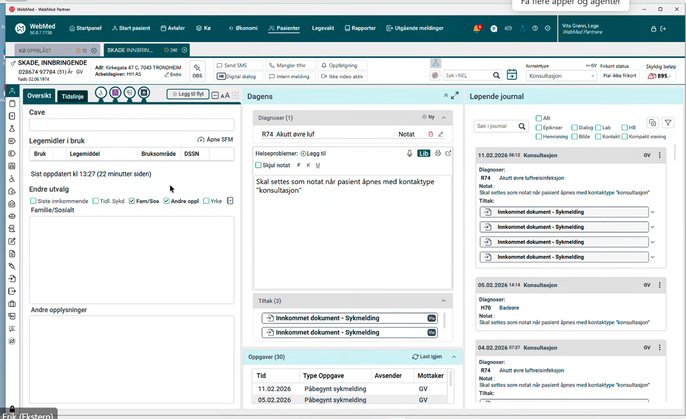

# Møte 34 i FHIR fagforum

* Dato: 2025-12-10
* Klokkeslett: 1300-1500
* 59 personer innom møtet virtuelt

FHIR fagforum (FFF) er et åpent forum om bruk og implementering av HL7 FHIR i Norge. FFF er åpent for alle.

## Agenda: SMART on FHIR

1. Velkommen, Thomas og Info fra HL7 Norge Øyvind, 10 min  
2. Informasjon om IHE Norge, Ingvar Sørlien (Sykehuspartner), 10 min
3. SMART on FHIR i HSØ, Anders Halling (Sykehuspartner), 30 min
4. Erfaring med SMART on FHIR, Erik Haug (NAV), 30 min  
5. Oppdaterte anbefalinger om SMART on FHIR, Frank Bråthen (Helsedirektoratet), 20 min
6. Diskusjon om utvalgte tema og invitasjon til SMART-SIG (Alle), 20 min
7. Eventuelt

## Presentations

* [FHIR fagforum intro](../docs/FHIR-faglig-forum/presentasjon/2026-02-11-FHIR-fagforum-34.pdf)  

## Info from HL7 Norge

* Midler under HTO for FHIR i kommunesektoren.
  * Kom med innspill om tiltak man kan finansiere med disse midlene
  * Conteir er i gang med en IG for kommunesektoren.
* HL7 WGM i Rotterdam 18-22 mai, HL7 Norge støtter deltakelse
* Basisprofiler Condition, Encounter og DiagnosticReport
  * Basis og no-domain skal over på hl7 norge sine hjemmesider
* Ønske om kurs etc?

## IHE Norge introduksjon

* Interoperabilitet og samhandlingsevne
* Ikke gjør dette alene.
* IHE anvender en velprøvd prossess for å etablere samhandling mellom virksomheter
* IHE sin rolle
  * Hvordan får man løsninger til å samhandle?
  * Spesifikajsoner for interoperabilitet - IHE implementing guides går også på tekniske krav
    * FHIF sier mye om innhold og mindre om tekniske løsninger
  * Testing
  * Koordinert bruk av etablerte standarder
* EU og EHDS
  * HL7 og IHE jobber sammen om krav og formater som skal brukes i EU
  * FHIR er sentralt men løser ikke alt
  * Mye i EHDS vil basere seg på IHE profler
  * MyHealth@EU for å dele mellom land er basert på IHE profiler
* IHE Connectathon
  * Mars i Brussel
  * IHE Plugathon
  * Experience days
* Invitasjon til å bidra
  * Spesialisthelsetjenesten har startet organisasjonen formelt
  * Medlemmer, spesielt leverandører
    * Helsetjenesten for å stille riktige krav
    * post@ihe-norge.no

## SMART on FHIR i HSØ

* Ingen implementasjon i HSØ i dag
* Behov og testaktiviteter + muligheter
  * Fragmentert landskap
  * Enklere å bruke SMART onFHIR for å få tak i informasjon fra eksterne kilder
  * Eventuelt FHIRcast
* Identitetsføderering er implementert.
* Man kan bruke samme mekanismer for bruk av access token for å få federert tilgang til data fra andre løsninger
* Krever mye spesialtilpasning
  
* Identifiserte behov i HSØ
  * Sanntidsvisning av ambulansejournal visning i DIPS
    * Streaming av EKG
  * Ernæringsokumentsajon med visning i DIPS
    * Felles løsning for sengepost
    * Med webapplikasjon representasjon av PEGA inn i DIPS
  * Bestilling og svar - visning i DIPS
    * Rekvirering og svar på lab prøver SaaS tjeneste fra DIPS
  * Radiologi 2.0 - visning av multimedieobjekter og SETW i DIPS
    * Sectra slutter CCOW og uthopp i 2027, SMARt foreslått som løsning
* Fellestrekk
  * Utvide funksjonaliteten i DIPS
  * Trenger pasientkontekst for å vise data fra en annen applikasjon
  * Access tokenet fra DIPS blir ikke stolt på at Sectra
* SMART on FHIR i HSØ
* SMART appen trenger mer enn den får fra HOST EPJ (DIPS)
  * To uavhengige Oauth/OIDC-klienter i SMART-appen
    * Kan føre til dobbeltautentisering
  * Utfordring med å transportere to tokens i tifeller der mellomvare forholder seg til SSO
* FHIRCast som erstatning for CCOW
  * Hub and spoke har hub i applikasjon på PC
  * FHIR cast har hub i server
* CCOW - levert va DIPS, ingen utivkling
  * komplisert å vedlikeholde
* FHIRCast baserer seg på SMART authentication server
  * Appikasjonene må forstå FHIR
* SMART on FHIR i HSØ
  * Kan vi fødert DIPS som SMART on FHIR autorisasjonsserver
  * Det kan gå, men er ikke sikre på at det vil fungere

### Question

Erik: Vi har mange av de samme problemstillinger

## NAV om SMART on FHIR

* Målet er at når helsepersonell skal sende inn data til NAV utvikler NAV løsningene
  * To typer applikasjoner, SMART on FHIR og webapplikasjoner, hovedfokus på SMART
* Sykemelding og legeerklæring om arbeidsuførhet
  * Høyt sykefravær - politisk vilje til å gjøre noe med det.
  * 2026 er fokuset på SMART on FHIR
  * 20 forskjellige applikasjoner som leverer sykemelding og legeerklæring
  * NAV har ansvar for direkte samarbeid med EPJ leverandørene
    * Stort fokus på å være comliant med standardene
* DEMO

* NAV appen i webmed 

  * Kontekst hentes fra Webmed
  * Logikken i sykemeldingen kan oppdateres for alle som skal bruke applikasjonen og distribueres direkte til leverandørene
  * Lagrer sykemelding i Webmed
  * Sykemeldingen sendes til NAV
  * Tilgjengelig oversikt over sykemelding i SMART appen
* Ting skal gjøres korrekt og i henhold til spekk
  * Ikke tilpasse klientapplikasjoner
  * FHIR ressurser som skal brukes i denne sammenhengen
  * Trenger ikke så mange ressurser for å representere sykemeldinginformasjon
  * Sikkerhet
    * Session tokens i browser startet, men ikke godt nok
    * Server delen av biblioteket ble videreutviklet til moderne autorisasjon
    * SMART on FHIr validator for å sjekke samsvar i data og tokens
    * EHR-launch

* SMART on FHIR launch sekvens i NAV
  * NAV må ha tillit til authorization serveren til EPJ
* Mulighet HelseID on smart on fhir
  * 
  * Tokenbytte mot HelseID
  * Bytte token igjen for aksess til bakenforliggende tjenester i NAV systemet
  * Dette er bare i teori, men ikke testet i praksis.
  * Ønsker samarbeid med leverandører
* Utfordringer
  * Sikkerhet og tokenshåndtering - kontakt NAV
  * EPJ-leverandører på forskjellige modenhet
    * Noen er skeptiske
  * Norges lover og regler
    * GDPR og tilbakeskriving av data
    * Hva kan vi dele mot hvem ? Hvorfor er tilbakeskriving vanskelig juridisk?
  * Varierende tolking av standarder
    * Tilpasset IG fra NHN har vært problematisk.
    * IG-er ikke oppdatert og avviker på noen punkter
      * Konsekvens er at apper utviklet etter denne ikke er compliant
  * Tilbakeskriving til EPJ
    * bare en PDF som tilbakeskrives
    * Kan gjøre andre ting for tilbakeskriving
      * Dødt dokument som kan vises av EPJ
    * Anbefaler å bruke Task med strukturerte data og referanser
    * EPJ får data de kan gjøre noe med.
    * Flyt
      * Opprette sykemelding
      * Sendes til NAV
      * NAV oppretter Task i EPJ
        * Encounter
        * Owner
        * Output
      * Task opprettes med status completed (historisk registrering)
      * Nav oppdaterer Task
    * Bruk av task gir
      * Mindre datamengde
      * EPJ får kontroll over data
      * Nav har ikke juridisk ansvar for hva EPJ viser
      * EPJ må gjøre noe for å håndtere Task og implementasjon
      * Ønsker å lande en slik tilnærming med markedet/leverandørene

### Question

Jus og tilbakeskriving

* Behandlingshjemmel for sykemeldingsarbeid
* Har NAV hjemmel til å skrive tilbake til EPJ
* I dag fylles det ut sykemelding og en melding
* Sourcing for appen mot leverandørene og NAV er databehandler for data i appen.
  * På vegne av hvem?
  * De er jo et ønske om at ting skal skrive tilbake til EPJ
  * Har Dag noe dokumentasjon om SFM

Launch contekst og forholde seg til standarder

* Launch contekst må også standardiseres for at det skal kunne fungee på tvers
Konteksten er hvem er brukeren.  

* Flyt mellom SMART authorization og HElseID er det basert på On Behalf of - tenker dere på RFC 8693 - OAuth 2.0 Token Exchange?
  * Ingen strukturert kontekst utover det som følger med session

* HelseID - støtter ikke alt vi ønsker, støtter HelseID token exchange?
  * Standardapplikasjoner kan være utfordrende å få støttet alle HelseID tilpasningene
  * Løsninger som skal støtte SMART on FHIR løsningene.
  * Primærhelse støtter HelseID
  * Verre med interne systemer i sykehus
  * Målgruppen for EPJ'ene som sender sykemelding
  * Samarbeide med DIPS om å verifisere med EPJ leverandører

