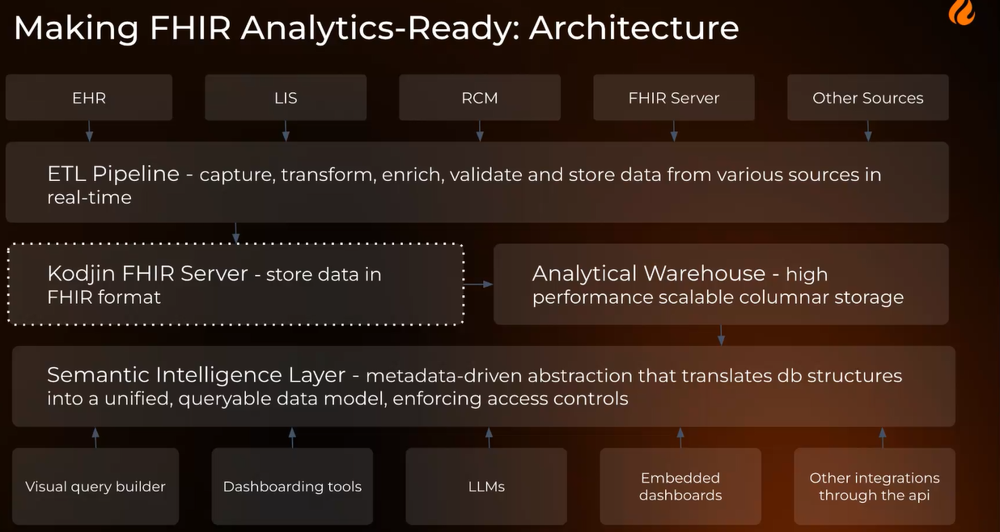

* Deltakere

## HL7 Norge informasjon

* Hackathon 2026 i november
* Ballot EU Patient summary - pasientoppsummeringer
* Connetathon i Rockwille USA
* Europeisk WGM i midten av november - sponset av HL7 Norge for norske deltakere, EHDS
* Kurs i EHDS før sommeren - svært vellykket

## Pasienten planer

Datadelingstjenester som utvikles i NHN sammen med sektoren. Tormod, Sigurd, Michal og 

* Deling og oppfølging av egenbehandlingsplan mellom lege sykehus, innbygger og fastlege
* Deling av behndling- og egenbehandlingsplan som er et viktig udekket samhandlingbehov for helsetjenesten.
* Prioriterer aktører som har reelle behov.
* MILA  - samarbeid om pasienter som har DHO, fase 1
  * 6 fritekstfelter og trafikklysmodell
  * Strukturerte data er det lite av i første fase.
* Aktiv plattformen
  * Aktiv med artrose
  * IHT integrerte helsetjenester
  * Mer struktur, mer ansvarsoverganger og samhandling
* Utviklingsløpet - problemstillinger for prosjektet som er under arbeid.

### Veiskille hvor det må gjøres noen valg

* Ønsker standardisering og håper at vi kan få til diskusjon og sparring for veien videre.
* Hva er pasientens planer?
  * Personas: Oddfrid
  * Sammensatte behov og flere deler av helsetjenesten er involvert.
  * Treningsopplegg fra fysio
  * Koordinering er utfordrende, mange modus for kommunikasjon
  * Pasientens planer skal kunne fungere som et nav for behandlingsplan.
    * DBEP er forsøkt før mellom pasient og fastlege gjennom kjernejournal
    * Versjon 1 er rigget bredere i utprøving med både primær og spesialist.
    * CarePlan - ble forsøkt brukt i DBEP - inneholdt ikke trafikklysmodellen
  * Datamodell ble 6 fritekstfelter og mål for behandling for å sjekke behov
  * NHN har modellert hendelser med operasjoner som skal forenkle flyten og bruken av API'ene.
    * Eksempel på hendelser og operasjoner i et tilfelle for oppdatering, stateless
    * Koblede FHIR ressurser
      * extensions
      * CarePlan?
      * Fasade?

## Edenlabs

Kseniia Nikolaienko - Head of Data and AI at Edenlab

> We have all of this FHIR data - can vi just point an LLM at it?

* Properties like extendability and references makes it hard to use for analytics.
* FHIR designed as an exchange format - not analytics.
* Data is available - 
* Between FHIR and LLM - Structural layer, semantic layer, privacy architecture

### Structural layer

Flattended data

* Streaming change capture - event propagate as it happens
* Transformation teplates - flatteened resources into rows - declarative - configuration not code
* Enrichments - references resolved, codes mapped and groupted displays and synonyms, terminology service inside pipeline
* Analytical store - columnar, pupulation scale, full history is kept

### Semantic layer

* Architecture - Validate etc
* Semantic layer - where meaning lives - 
  * Concepts, not columns - makes answers deterministic and explainable
  * Definitions carry their logic - 
  * Tractable to build
  * Governed and versioned
* The Semantic layer Compiles the queries into SQL 
* From Question to governed query
  * User can check the interpretation of the question.
  * Definitions should be well defined, written down (explicit) and agreed upon

### Privacy layer

* Privacy by design
* The LLM sees only semantic catalog: concept names, definitions and relationships - never touches the data directly

### Live Demo

* Answers complex questions and produces answers fast.
* 

## Status from HL7 Sweden

Nordic update: Sweden, Mattias Colliander

