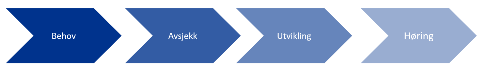

# Prosess for normering av FHIR profiler i Norge

Da FHIR standarden ble utviklet var det et stort ønske om mer agil standardiseringsprosess, mer rettet mot erfaring fra utviklere enn det som tidligere standarder har hatt. For å oppnå den agile tilnærmingen, samt å innhente mest mulig erfaring fra bruk, så har man i større grad enn tidligere, tillatt «kaos» rundt standardiseringsprosessen. Så langt viser dette at FHIR er en suksesshistorie, både pga. utviklingsvennligheten, men også pga. mulighetene til å ta i bruk standarden umiddelbart. Prosessen rundt FHIR profiler i Norge har pågått internt i prosjekter i de ulike regionene. Det har vært tilfeller der flere regioner arbeider på samme utfordringsområder og profiler – uten å vite at de kunne jobbet sammen om dette. Det har gitt litt av det «kaoset» som man forutså. Nå er FHIR-standarden og ressursene nær ved å bli normative (endelig versjonert standard) at vi ønsker å sørge for forutsigbarhet ved å sikre størst mulig grad av omforent tilpasning av FHIR til nasjonale forhold. Ved å definere prosessen og samkjøre den med HL7 Norge, ønsker vi å få mer oversikt, få utnyttet ressurser i regionene på en best mulig måte og bidra til størst mulig grad av gjenbruk av FHIR-profiler på tvers av tjenester og leverandører.  

## Behov

Prosjekter starter ofte med et overordnet blikk på integrasjoner, uten spesifisering av hva som skal integreres annet enn et navn på hva som skal hentes. Eksempler kan være «Hent pasient», «Diagnoseoversikt» og «Timeoversikt». Hver av disse inneholder mye informasjon, og krever god oversikt over informasjonselementene som ligger i hver av spørringene. Det er derfor viktig at integrasjonsarkitekter tas med i en tidlig fase av planleggingen, slik at en på et tidlig stadium kan få oversikt over tid, kostnad og ressursbehov.

### Behov for integrasjon

Behov for integrasjon mot andre systemer kan være behov for å hente masterdata (eksempel – Pasientdata fra EPJ), innhenting av medisinsk informasjon (eksempel røntgensvar, laboratoriesvar eller kritisk informasjon). Det kan også være krav om å dele informasjon som lages i ett system. En integrasjonsarkitekt (eller virksomhetsarkitekt) vil begynne med å gruppere behovet for integrasjonene i overordnet grupperinger som «Pasientdata» eller «Laboratoriesvar». Det bør tidlig gjøres en oversikt over hva disse grupperingene bør inneholde av informasjonselementer.

### Brukertilfeller og brukerhistorier

Brukertilfeller eller brukerhistorier er små tiltenkte historier som beskriver ønsket arbeidsflyt der data skal sendes eller hentes fra/til andre systemer. Slike historier legger et godt grunnlag for hvilke informasjonselementer som det er behov for i arbeidsprosessen.

>Eksempel på en brukerhistorie: Arild Johnsen har blitt henvist fra sin fastlege til Stavanger Universitetssykehus. Hen er henvist på grunn av vedvarende problemer med kneet. Han har ikke hørt fra sykehuset på 7 dager etter han ble henvist. Han logger derfor på www.helsenorge.no for å se statusen på henvisningen sin. Han logger på portalen med sin Mobil BankID. Han velger så «Referanser». I dette valget får han opp en liste over henvisninger til sykehuset. Han ser at henvisningen er mottatt men statusen er «Ikke evaluert». Han venter så til neste dag og logger på igjen. Statusen er nå «Time tildelt» og timen er listet under henvisningen.

### Informasjonselementer

Brukerhistoriene gir et godt overblikk over hvilke informasjonselementer som må på plass i spørring og svar. Integrasjonsarkitektene bør sette opp en liste over hvilke essensielle informasjonselementer som må med. Listen bør ta høyde for hele arbeidsprosessen, da integrasjonen mulig bør ta med elementer som skal benyttes senere i samme prosess.Et godt tips for arbeidet rundt informasjonselementer er å benytte de internasjonale ressursene og sette de opp i et Excel-ark. Avsjekk hvilke informasjonselementer som er helt essensielle for prosjektet, samt hvilke som kan utelates.Alle ressusene finnes på [www.hl7.org/fhir](www.hl7.org/fhir)

## Avsjekk

### Eksisterende profil

Første sjekk bør være om det finnes eksisterende profil på området i Norge. Profilene skal ligge på www.simplifier.net under HL7 Norge. Det bør også sjekkes på www.hl7.no om det pågår [andre initiativ/prosjekt i Norge](https://hl7norway.github.io/best-practice/docs/activities-norway.html) som jobber med samme ressurser. Det skal eksistere kontaktinformasjon mot de ulike initiativene, slik at dersom noe ligner eller kan slås sammen med det som prosjektet driver med – så ta kontakt og samarbeid for å kunne dra nytte av hverandre i jobben.  

### Basisprofiler

Norge jobber med å få opp  basisprofiler (se definisjon) av FHIR-ressurser som tas i bruk i Norge.  Basisprofiler er uavhengig av use-case. Hensikten med basisprofiler er mest mulig gjenbruk av profilering på tvers av implementasjoner. Prosjektets bør ta utgangspunkt i basisprofiler for ressurser der disse eksisterer. Basisressurser kan settes sammen og danne en ny profil for det spesifikke behovet.  

### Områdeprofiler
Dersom prosjektet ser behov for profilering utover nasjonale basisprofiler som kan gjenbrukes i andre prosjekter bør prosjektet også initiere en prosess sammen med HL7 Norge for å utvikle nasjonale områdeprofiler.

### Avdekke behov for Extensions

Enkelte ganger dekkes ikke prosjektets informasjonsbehov av de internasjonale standard ressursene.  HL7 spesifiserer i tillegg til vanlige ressuser såkalte «standard Extensions». Dette er Extensions som blir ansett som ofte benyttet, men ikke nok til at de er tatt inn i den standardiserte ressursen. Det bør gjøres en sjekk på om behovet i prosjektet dekkes av standard Extensions.  Hvis ikke kan det defineres egne ekstensjoner. Disse bør forankres nasjonalt dersom de anses å kunne gjenbrukes av andre prosjekter.

### Levere nasjonale profiler

Arbeidet i HL7 Norge foregår på frivillig basis. I praksis betyr dette at vi er alle ansvalig for at arbeidet kommer alle til gode. På den måte får vi best mulig standardisering i Norge, og kan hjelpe andre prosjekt i egen og andre organisasjoner. Dersom prosjektet ser at profilene i Norge ikke dekker behovet og at det må nye ressurser på plass, samt at behovet er stort nok til å ta i bruk en full ny FHIR ressurs, så bør prosjektet ta høyde for å definere nasjonale profiler.  

### Pågående prosjekter – HL7 Norge

HL7 Norge har som mål å få oversikt over pågående profileringsarbeid på FHIR i Norge. For å få til dette trenger vi deres hjelp. Ta kontakt med HL7 Norge på post@hl7.no og meld fra om prosjektets arbeid. Gjerne med opplysninger om kontaktperson, slik at andre kan ta kontakt dersom de planlegger å jobbe med samme type integrasjon.

## Utvikling

### Utvikle profil

Kompetansen på FHIR i Norge er under stadig utvikling. Flere og flere klarer å utvikle profiler selv. Dersom prosjektet ikke har tilgang på ressurser så har Helse Vest, Helse Nord og Helse Midt-Norge rammeavtale med Furore. Furore er et Nederlansk konsulentfirma som har spesialisert seg på FHIR profilering.  Furore kjenner godt til det norske helsevesen, men godt spesifiserte behov og brukerhistorie gjør jobben raskere for dem. www.simplifier.net eller helt enkelt Excel kan benyttes i starten på utviklingen av FHIR profiler. Underveis i utviklingen er det fullt mulig å etterspørre hjelp, enten via Zulip (HL7 Internasjonalt) eller via HL7 Norge (send melding til tsk@hl7.no).  

### Publisering av profil

Når profilen er ferdig utviklet bør den ligge under «til høring» i Simplifier under området til HL7 Norge. HL7 Norge har 3 brukerlisenser som kan tildeles ved behov. Ta kontakt på post@hl7.no for å få tildelt bruker, ev. be om at det som dere har laget i Simplifier overføres til HL7 Norge sitt område.  

## Høring

### Nasjonal høring i regi av HL7 Norge

HL7 Norge har ansvaret for høring på nasjonale profiler for FHIR i Norge. Høringen er viktig for å få sendt den til alle intressenter, og til andre som har erfaring på FHIR. Lengden på en høring er avhengig av hvor stor profilen er og når på året den sendes ut. En stor profil som sendes ut rett før sommerferien vil som regel ha lengre høringstid enn en som sendes ut på høsten. Beregn generellt en måned med høring.  

### Oppdatering

En høring vil gi utslag i tilbakemeldinger. Tilbakemeldingene skal gjennomgås i første omgang av HL7 Norge sin tekniske styringskomite.  Enhver tilbakemelding skal evalueres og kan ikke forkastes med mindre tilbakemelder selv ønsker å trekke tilbakemeldingen basert på informasjon som kommer fra teknisk styringskomite. Tilbakemeldingene kan tas delvis hensyn til, eller tas hensyn til med moderering. Tilbakmelder vil da få spørsmål om dette tilfredstiller kravet/behovet. Basert på de tilbakemeldingene som så blir tatt hensyn til – så må profilen oppdateres. Etter denne oppdateringen kan så profilen publiseres på Simplifier som «Nasjonal».  

## Sjekkliste Normering HL7 Norge

- [ ] Er alle integrasjonsbehov beskrevet med informasjonselementer og brukerhistorier?
- [ ] Er informasjonselementene knyttet til FHIR ressurser?
- [ ] Meld fra til HL7 Norge om pågående arbeid
- [ ] Finnes det pågående prosjekt/initiativ i Norge som jobber med samme ressurser?
- [ ] Finnes det basisprofiler i Norge som samsvarer med behovet?
- [ ] Kan prosjektet utvikle basisprofiler?
- [ ] Finnes eksisterende profiler?
- [ ] Har prosjektet ressurser som kan lage FHIR profiler?
- [ ] Lag profil
- [ ] Meld fra til HL7 Norge om profil klar for høring
- [ ] Oppdater etter tilbakemelding
- [ ] Utvikle integrasjonen
