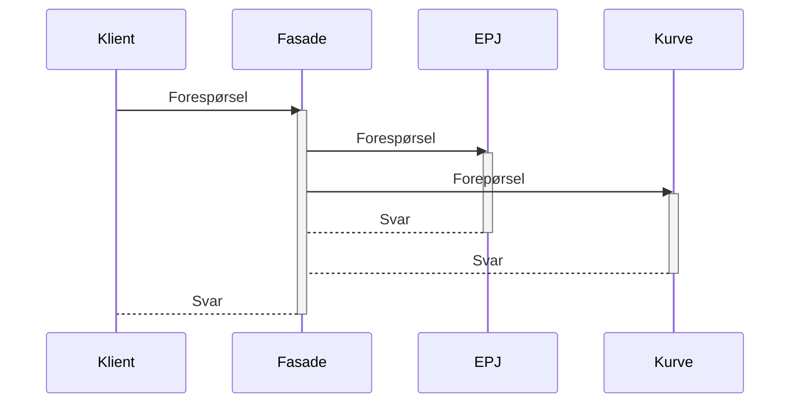

# Fasade

Under arbeid!

----

>**In a façade model (...), data remains in its existing source system. When queried, data is mapped to FHIR on the fly and delivered in real-time from existing data sources.**
 
>In the repository model (...), a new asset is created to store a copy of the data separately—a native FHIR clinical data repository. 

Referanser:
- [Smile - Facade Hybrid or Repository](../reference/Smile%20-%20Facade%20Hybrid%20or%20Repository.md) (sitatene over)
- [Wikipedia](https://en.wikipedia.org/wiki/Facade%20pattern)

>The **Facade pattern** (also spelled façade) is a  software-design pattern commonly used in object-oriented programming. Analogous to a facade in architecture, a facade is an object that serves as a front-facing interface masking more complex underlying or structural code. A facade can:
>- improve the readability and usability of a software library by masking interaction with more complex components behind a single (and often simplified) API
>- provide a context-specific interface to more generic functionality (complete with context-specific input validation)
>- serve as a launching point for a broader refactor of monolithic or tightly-coupled systems in favor of more loosely-coupled code 
>Developers often use the facade design pattern when a system is very complex or difficult to understand because the system has many interdependent classes or because its source code is unavailable. This pattern hides the complexities of the larger system and provides a simpler interface to the client. It typically involves a single wrapper class that contains a set of members required by the client. These members access the system on behalf of the facade client and hide the implementation details.
>[Wikipedia](https://en.wikipedia.org/wiki/Facade%20pattern)
