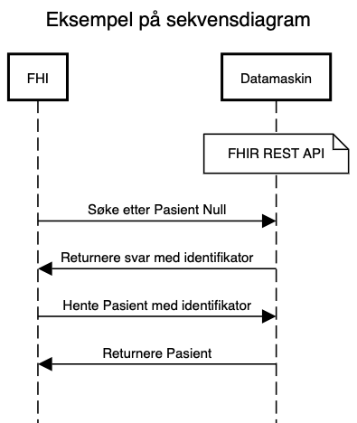

# Den gode implementasjonsguide

_Denne veilederen er under arbeid - versjon 0.3_

* Prosjekt: [https://github.com/HL7Norway/best-practice/projects/3 ](https://github.com/HL7Norway/best-practice/projects/3)

* Plan: Publisere en versjon 1.0 i løpet av <s>2021</s> 2022.

* Issues: [https://github.com/HL7Norway/best-practice/issues?q=is%3Aissue+is%3Aopen+label%3ADGI](https://github.com/HL7Norway/best-practice/issues?q=is%3Aissue+is%3Aopen+label%3ADGI) (tag = DGI)

## Om Den gode implementasjonsguide (DGI)

Denne veilederen gir krav og beste praksis for en HL7 FHIR implementasjonsguide (IG) for å sikre kvalitet, god lesbarhet og forståelse av innholdet.

IGer kan være gjenstand for normering av Direktoratet for e-helse, derfor er det brukt uttrykk som SKAL, SKAL IKKE, BØR, BØR IKKE, KAN, KAN IKKE i henhold til [RFC 2119](https://www.ietf.org/rfc/rfc2119.txt) slik at en IG kan testes for konformitet mot denne veilederen.

Det oppfordres om å komme med tilbakemeldinger og forslag om innhold og utforming av denne veilederen - bruk [issues](https://github.com/HL7Norway/best-practice/issues) med label _DGI_.

## HL7 best practice for FHIR ImplementationGuide

* HL7 sin [IG Review](https://confluence.hl7.org/display/FHIR/FHIR+IG+Review) liste
* HL7 [IG best practice](https://build.fhir.org/ig/FHIR/ig-guidance/best-practice.html)

## Anvendelse

Implementasjonsguiden må være klar på hvilke anvendelser den er ment å løse. Den må fortelle om den er basis for videre profilering, eller skal brukes som den er.

### Forretningsprosess og samhandlingsform

Hvis IGen er beregnet på en spesiell samhandlingsform (datadeling/API, dokument, meldingsutveksling) BØR den inneholde ett eller flere sekvensdiagram som forklarer informasjonsflyten mellom aktørene (forretningsprosess).

Foreslåtte notasjoner:

* UML sekvensdiagram
  * TIPS: [sequencediagram.org](https://sequencediagram.org) - enkelt verktøy som kan versjonshåndteres
* [BPMN](https://en.wikipedia.org/wiki/Business_Process_Model_and_Notation)

## Kontekst og historikk

IG-en SKAL oppgi hvem som aktivt forvalter den.

IG-en BØR ha med informasjon om hvordan den ble tatt frem, for eksempel

- om initiativet bak, i hvilket prosjekt/program som utviklet den
- om den er en del av et større arbeide

## Profiler

Alle profiler SKAL være med som _StructureDefinition_.

Tilstrekkelig beskrivelse SKAL inkluderes i _StructureDefinition.description_.

## Utvidelser (extensions)

Alle utvidelser SKAL være med som _StructureDefinition_.

Tilstrekkelig beskrivelse SKAL inkluderes i _StructureDefinition.description_.

## Kodeverk

Alle _ValueSet_ BØR være med i IG-en. _ValueSet_ som er spesielle for IG-en SKAL være med, mens gjenbruk/eksterne KAN refereres til hvis kilden kan ansees som stabil.

Alle _CodeSystem_ og _NamingSystem_ KAN være med, hvis ikke SKAL det oppgis referanser.  

## Eksempler

IG-en SKAL inneholde eksempler på bruk av profilene i form av JSON og/eller XML.

Eksemplene BØR være realistiske med utgangspunkt i anvendelsen, men trenger ikke å være utfyllende.

## Versjonering

* [Versjonering implementasjonsguide](../../docs/ig-versioning.md)

## Publisering

IG-en BØR være publisert åpent og fritt tilgjengelig på internett.
IG-en SKAL publiseres åpent og fritt tilgjengelig hvis den er gjenstand for (fremtidig) normering.

## Forvaltning og kontaktinformasjon

Det SKAL oppgis kontaktinformasjon til ansvarlig forvalter og hvordan man kan melde inn ønsker om endringer, feil i dokumentasjon og lignende. Slike tilbakemeldinger BØR være tilgjengelig for alle i form av en _issue tracker_, eksempelvis på GitHub eller annet egnet verktøy.

### Avsluttet forvaltning

Hvis en publisert IG ikke lenger aktivt forvaltes BØR den merkes tilsvarende, og BØR inneholde en referanse til eventuelle andre (aktivt) forvaltede IG-er for tilsvarende eller lignende anvendelse.

# Krav for IG som spesifiserer et API

## Queries

IG-en SKAL dokumentere hvilke _queries_ som støttes. Det SKAL dokumenteres hvilke standard-_queries_ (i følge HL7 FHIR) som ikke støttes.

## Operations

IG-en SKAL dokumentere hvilke _operations_ som støttes.

### Pakkettering

IG-er som benyttes for API BØR publiseres som en pakke.
[Diskusjon: Bør dette gjelde alle IG-er?]

* [NPM Package Specification](https://confluence.hl7.org/display/FHIR/NPM+Package+Specification)
