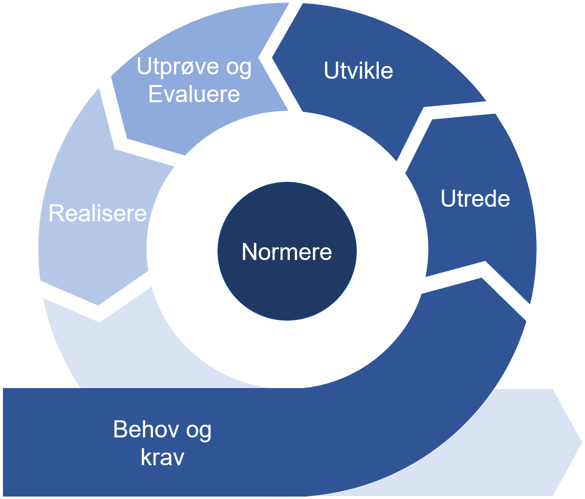

# Beskrivelse av utviklingsmetoden

Metoden benytter seg av faser som er beskrevet i forvaltningsmodellen og beskriver hvilke konkrete arbeidsoppgaver som må gjennomføres i hver av fasene når områdeprofiler skal utvikles.
  

**Figur** Metode for områdeprofilering

## Forvaltningsmodellen og smidig utvikling

Forvaltningsmodellen for normerende produkter må sees i sammenheng med metoden for utvikling av områdeprofiler, siden disse er gjensidig avhengige. stiller konkrete krav til hvordan utviklingen av områdeprofilene skal gjennomføres mens forvaltningsmodellen stiller krav til hvordan det normerende produktet kan normeres.

Når smidig metode tas i bruk vil utviklingsarbeidet foregå før, under og etter at hele eller deler av områdeprofilen er normert. Metoden beskriver hvordan normeringsnivå for normerende produkter og modenhetsnivå for profiler settes. Normeringsnivå og modenhetsnivå benyttes sammen for å understøtte smidig utvikling av normerende produkter. Normerende produkter kan publiseres med økende normeringsnivå etter hvert som modenheten øker basert på erfaring med implementasjon og bruk av produktet.

Utviklingen av områdeprofilen vil ofte skje i sammenheng med utviklingen av programvare/tjeneste som skal løse et samhandlingsbehov. Utvikling, test og driftssetting av programvareproduktet trenger ikke være en del av utviklingsprosjektet for områdeprofilen, men i mange tilfeller vil disse være tett sammenkoblet eller del av samme prosjekt.

## Fasene i utviklingsmetoden

### [Behov og krav](behov-og-krav.md)

### [Utrede](utrede.md)

### [Utvikle](utvikle.md)

### [Utprøve og evaluere](utprøve-og-evaluere.md)

### [Realisere](realisere.md)

### [Normere](normere.md)
