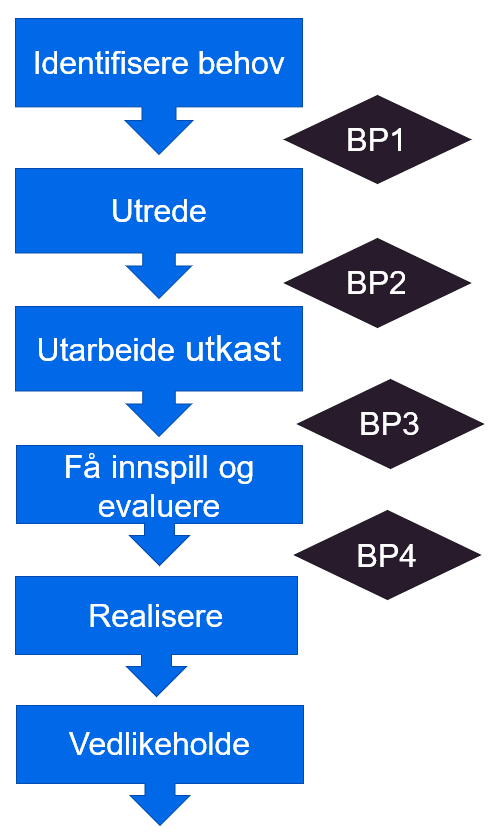

# Bakgrunn

## Strategisk retning innen normering

Internasjonale standarder og internasjonalt samarbeid om e-helse er og vil bli mer aktuelt i fremtiden. Direktoratet for e-helses rapport [Utviklingstrekk 2020](https://ehelse.no/publikasjoner/rapport-utviklingstrekk-2020) peker på at utfordringer innen helsesektoren er sammenfallende for flere land og at det er viktig å være med i internasjonalt standardiseringsarbeid for å utvikle, lære og bidra til felles løsninger.

Direktoratet for e-helse har tidligere utarbeidet Strategi for e-helsestandarder 2018-2022 med de tre fokusområdene nasjonal styring, standardisert informasjonsinnhold og internasjonale standarder. [Veikart og planer for e-helsestandarder](https://ehelse.no/publikasjoner/veikart-og-planer-for-e-helsestandarder-2018-2022) følger opp strategien gjennom å beskrive tiltak innenfor internasjonale standarder for datadeling og dokumentdeling.

## Direktoratets anbefalinger

I 2019 ble det utgitt [retningslinje hvor direktoratet anbefaler bruk av FHIR for datadeling](https://ehelse.no/standarder/ikke-standarder/anbefaling-om-bruk-av-hl7-fhir-for-datadeling). Samme år ble også 13 FHIR basisprofiler utviklet i samarbeid mellom sektor, HL7 Norge, og Direktoratet for e-helse [normert som anbefalt standarder i referansekatalogen](https://ehelse.no/standarder/norske-basisprofiler-for-hl7-fhir).

Det er også arbeidet med prinsipper og tiltak for nasjonal styring og forvaltning av FHIR. FHIR er en viktig standard som nå tas i bruk i mange sammenhenger, og arbeidet med denne vil også fungere som utprøvingsarena for prosesser, rutiner og koordinering med andre internasjonale standarder.

## Metodegrunnlag

Forslaget til metode bygger i hovedsak på eksisterende metoder innen normering, arkitektur og programvareutvikling.

### Smidig tilnærming

Det er et ønske om å modernisere hvordan programvareutviklingen og normeringen blir gjennomført i helsesektoren. Det er et mål at normeringsaktiviteter i større grad er basert på dokumenterte behov i sektoren, og hvor sektoren er motivert til å delta i normeringsarbeidet både i standardiseringsorganisasjoner (som HL7 Norge) og i samarbeid med Direktoratet for e-helse. Dette betyr at normeringsarbeidet må henge sammen med utviklingsprosjekter i sektoren og følge en smidig tilnærming hvor normeringsproduktene leverer verdi til sektor underveis i utviklingsløpet og blir videreutviklet og komplettert i videre iterasjoner.  

**Figur** Smidig utviklingsmetode

Smidig tilnærming betyr at normeringsproduktene eller deler av disse må utvikles, testes og settes i drift i løpet av en sprint slik at man kan evaluere hvordan produktet fungerer i praksis. Dette vil vanligvis være avhengig av at normeringsaktiviteten er koblet til en utviklingsaktivitet.

### Forvaltningsmodellen

[Forvaltningsmodell for normerende produkter](https://ehelse.no/publikasjoner/forvaltningsmodell-for-normerende-produkter-fra-direktoratet-for-e-helse) beskriver hvordan Direktoratet for e-helse skal utvikle og forvalte normerende produkter.  

Metode for HL7 FHIR områdeprofiler beskriver hvordan utviklingen av områdeprofiler forholder seg til forvaltningsmodellen og omvendt.  

**Figur** Fasene i forvaltningsmodellen

### HL7 FHIR utviklingsmetode

HL7 International benytter i utviklingen av HL7 FHIR selv en form for iterativ metode. Standarden blir normert over flere år og det er i skrivende stund bare deler av standarden som anses som normativ. I utviklingen av en metode for områdeprofiler er det derfor naturlig å gjenbruke de samme mekanismene for standardisering som HL7 benytter i utviklingen av FHIR, blant annet [maturity model](https://confluence.hl7.org/display/FHIR/FHIR+Maturity+Model).  

### Profileringsnivåer for HL7 FHIR i Norge

I Norge arbeides det med profilering av HL7 FHIR på flere grader av detaljering.  Øverst i det norske profileringshierarkiet har vi norske basisprofiler som skal sammenfatte omforente krav til hvordan FHIR ressurser skal benyttes i Norge uavhengig av anvendelsesområde. Disse profilene er åpne og inneholder bare det alle aktører er enige om med hensyn til koding og navngivning av ressurser og navnerom. De norske områdeprofilene er ment som et profileringsnivå under basisprofilene og har som formål å presisere bruk av HL7 FHIR innen et bestemt anvendelsesområde. Prosjekter og implementasjoner kan deretter velge å profilere implementerte profiler knyttet til en konkret implementasjon. Disse kan inneholde spesifikke krav som bare gjelder innenfor en virksomhet.

**Figur** Profileringshierarki for HL7 FHIR i Norge

### Prosjektveiviseren

Metoden baserer seg på Digitaliseringsdirektoratets veileder for bruk av smidig metode for programvareutvikling, [Prosjektstyring og smidig utviklingsmetodikk](https://www.prosjektveiviseren.no/prosjekttyper/digitaliseringsprosjekter/programvareutvikling/prosjektstyring-og-smidig-utviklingsmetodikk). Digitaliseringsdirektoratets veileder beskriver hvordan smidig kan benyttes i alle prosjektets faser og beskriver eksempler på epos og hvordan de forskjellige fasene i prosjektmodellen kan deles inn i flere sprinter/iterasjoner.

**Figur** Smidig utviklingsmetode Digitaliseringsdirektoratet
