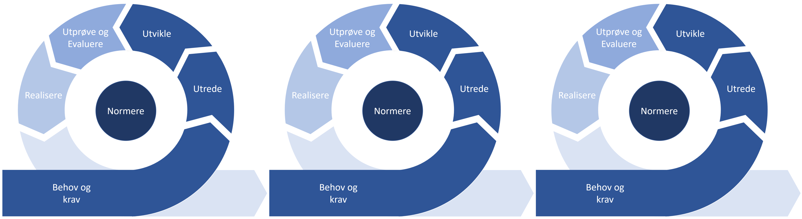
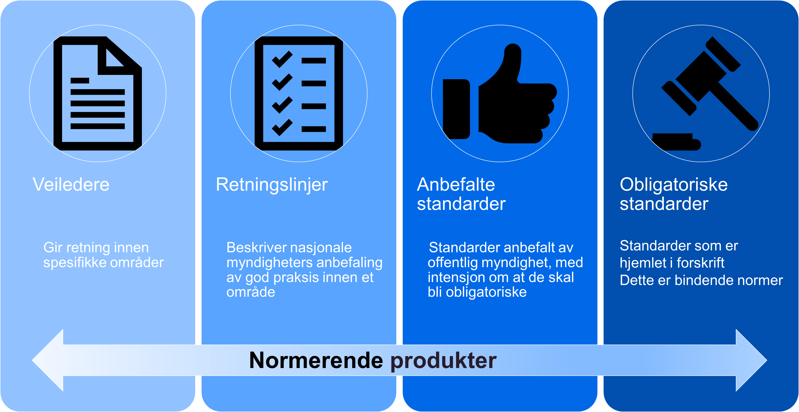
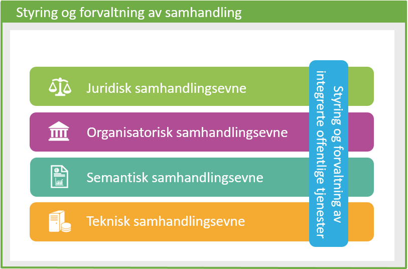
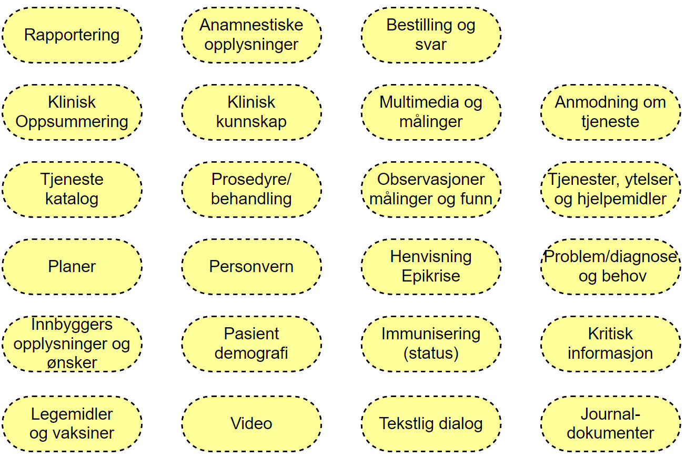
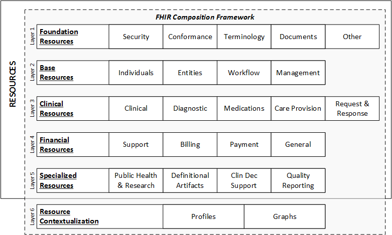

# Bruk av metoden

Metoden som er beskrevet kan anvendes smidig gjennom kontinuerlige iterasjoner og det er forventet at metoden må tilpasses etter behov i det enkelte utviklingsprosjekt. Metoden må tilpasses utviklingsprosjektet avhengig av prosjektets størrelse og kompleksitet.  
Det må vurderes om det skal utvikles dokumentasjon som skal testes av eksterne programvareprodukter, eller om prosjektet også skal inkludere utvikling av programvare som skal ta profilene i bruk. Slike valg vil påvirke innhold og detaljeringsnivå i de forskjellige fasene metoden beskriver.

## Iterativ bruk av metoden

Metoden er beskrevet for at det skal være enkelt å benytte flere iterasjoner ved gjennomføringen av et prosjekt. Ved iterativ tilnærming må resultatet av realiseringen i forrige iterasjon legge grunnlaget for arbeidet i neste iterasjon, som vist i figuren:

**Figur** Iterativ tilnærming til områdeprofilering

I fasen «behov og krav» er det fokus på å styre aktiviteten i riktig retning basert på erfaringer fra tidligere iterasjoner. Erfaringsmessig kan både behov og krav endres basert på erfaringer som gjøres underveis i utviklingsarbeidet. Endringer i behov og krav vil påvirke spesifikasjon og det ferdig implementerte produktet. Fasen må også inneholde en prioriteringsaktivitet, hvor oppgaver som skal løses i neste iterasjon/sprint diskuteres og arbeidet i neste iterasjon planlegges.  
De forskjellige iterasjonene kan ha fokus på hele eller deler av modellen. I en kravfase kan man for eksempel ha stort fokus på behov, krav og utvikling av kravspesifikasjon og profiler. I en realiseringsfase fokuserer prosjektet på å klargjøre kravbeskrivelsen for implementasjon og har fokus på testing og realisering av løsningen som skal tilby funksjonaliteten som tilfredstiller kravene.  

## Modenhetsnivå og normeringsnivå

Metoden for områdeprofiler tar i bruk modenhetsnivå og normeringsnivå for å muliggjøre iterativ utvikling av normerende produkter. Normeringsnivåene definert i forvaltningsmodellen gjør det mulig å utvikle normerte produkter med lavere normeringsnivå som siden kan utvikles til retningslinjer og anbefalte/obligatoriske standarder når aktørene får erfaringer fra implementasjon og bruk.  
Modenhetsnivåene definert av HL7 International beskriver kategorier av modenhet til enkeltartefakter i en spesifikasjon. Modenhetsnivåene definerer hvilke krav til erfaring og implementasjon som kjennetegner hvert nivå og synliggjør nivået av erfaring knyttet til hvert enkelt artefakt i implementasjonsguiden. Metoden beskriver også hvilket modenhetsnivå som kreves for å publisere et normerende produkt på et gitt normeringsnivå.  

### Bruk av normeringsnivå (for områdeprofiler)

**Figur** Normeringsnivå definert av e-helse

Direktoratet for e-helse publiserer normerende produkter innenfor fire definerte normeringsnivå. Nivåene er definert ut fra krav til kvalitetssikring, forankring og kunnskapsgrunnlag for produktet. Det er naturlig at normeringen av områdeprofiler gjennomføres i henhold til de definerte normeringsnivåene. Normeringsnivåene og kravene til normerende produkter som skal falle inn under de forskjellige nivåene er beskrevet i [forvaltningsmodellen for normerende produkter](https://ehelse.no/publikasjoner/forvaltningsmodell-for-normerende-produkter-fra-direktoratet-for-e-helse).

For områdeprofilene vil betydningen av normeringsnivåene være:

**Veileder**: En områdeprofil som er publisert som veileder betyr at virksomheter og prosjekter som utvikler eller anskaffer løsninger hvor anvendelsesområdet faller helt eller delvis innenfor en eller flere områdeprofiler bør vurdere å benytte de publiserte områdeprofilene for samhandlingsløsninger.  

**Retningslinje**: En områdeprofil som er publisert som retningslinje betyr at de delene av løsningen hvor anvendelsesområdet faller helt eller delvis innenfor omfanget av en eller flere områdeprofiler skal følge disse. Det kan aksepteres at ved særlige og godt begrunnede omstendigheter kan løsninen se bort fra krav spesifisert i noen deler av områdeprofilen.  

**Anbefalt standard**: En områdeprofil som er publisert som anbefalt standard betyr at løsninger i tilknytning til det definerte anvendelsesområdet skal benytte standarden med mindre særskilte omstendigheter kan begrunne et avvik.  

**Obligatorisk standard**: En områdeprofil som er publisert som obligatorisk standard er bindenden normer hjemlet i forskrift. En obligatorisk standard skal følges med mindre det er gitt unntak med hjemmel i forskriften. En løsning hvor deler av anvendelsesområdet faller inn under det definerte området må derfor følge standarden eller søke om unntak fra forskriften.  

### Krav til modenhetsnivå for områdeprofiler

HL7 International benytter modenhetsnivå for å angi hvor godt en del av standarden er testet og utprøvd. I forbindelse med utarbeidelse og normering av områdeprofiler skal modenhetsnivåer benyttes for å angi hvordan de forskjellige delene av områdeprofilen (typisk definerte profiler og utvidelser) er utprøvd i praktisk bruk. Modenhetsnivået for hvert artefakt defineres som en del av implementasjonsguiden.

#### Kartlegging og vedlikehold av modenhetsnivå

For å kartlegge hvilket modenhetsnivå et artefakt har må aktøren som forvalter artefaktet kartlegge hvordan denne er implementert, testet og tatt i bruk i egen organisasjon og av andre aktører. Det anbefales at kartleggingen gjennomføres i samarbeid med HL7 Norge og Direktoratet for e-helse. Etter hvert som områdeprofilen utvikles og tas i bruk av flere aktører vil modenhetsnivået øke. Dette signaliserer at flere virksomheter har gjennomført flere implementasjoner og har profilene i test og drift slik at profilene har oppnådd høyere modenhet.

#### Modenhetsnivå for norske områdeprofiler

Beskrivelsen av modenhetsnivå for de norske områdeprofilene bygger på HL7 International sine modenhetsnivå men er en omskrivning av disse for norske forhold.

Modenhetsnivå|Beskrivelse|Normeringsnivå (anbefalt)
-|-|-
Draft (0)|Dokumentasjon og definisjon av artefaktet er publisert på egnet plattform og kan leses av andre virksomheter.|Kan ikke normeres
1|PLUS artefaktet produserer ikke feil eller advarsler under byggeprosessen og er vurdert som klar for implementasjon. Ressursene, implementasjonsguidene og profilene inneholder dokumentasjon på hvordan samhandlingen skal løses.|Veileder
2|PLUS artefaktet er testet og støtter den beskrevne brukerhistorien for samhandling. Testingen er gjennomført med minst to separate systemer og omfatter størstedelen av kjerneelementene som er nødvendig for samhandlingen.|Veileder
3|PLUS artefaktet er verifisert i henhold til definert beste praksis i Norge. Det skal være registrert minst 10 implementasjons kommentarer registrert fra minst 3 virksomheter og som resulterte i minst en endring av artefaktet.|Retningslinje
4|PLUS artefaktet er testet for alle spesifiserte anvendelser som er behandlet i Teknisk Styringskomite. Flere prosjekter og systemer har implementert profilen. Artefaktet er vurdert som tilstrekkelig stabil til at de som har implementert profilen må konsulteres før ikke-kompatible endringer gjennomføres|Retningslinje.
5|Artefaktet er implementert i minst 3 selvstendige produksjonssystemer.|Anbefalt standard
Normative|Artefaktet er stabil og er normert i henhold til HL7 Norge og Direktoratet for e-Helse sin normeringsprosess.|Anbefalt eller forskriftsfestet standard

Flere av modenhetsnivene krever at det er gjennomført forankring og sendt informasjon til HL7 Norge og Direktoratet for e-helse.

Enkelt-artefakter innen en Implementasjonsguide kan ha forskjellige modenhetsnivå, en IG som skal normeres må minst inneholde artefakter av nødvendig modenhet for å normeres på et gitt normeringsnivå.

## Kravkategorier

European Interoperability Framework 2.0 (EIF) viser hvilke lag som må på plass for å oppnå samhandlingsevne. Det kan finnes norske og internasjonale krav som skal eller bør følges når man utvikler en områdeprofil og implementasjonsguide. Dette skal kartlegges som en del av fasen [Utrede](utrede.md).

Se også [Rammeverk for digital samhandling](https://www.digdir.no/nasjonal-arkitektur/rammeverk-digital-samhandling/2148) hos Digitaliseringsdirektoratet om EIF.  

**Figur** Rammeverk for digital samhandling

### Juridisk samhandlingsevne

Finnes det juridiske krav til samhandlingen? Juridiske krav kan omhandle og legge føringer for alle underliggende lag. Eksempel er krav om foreldresamtykke for barn under 16 år ved henvisning til spesialisthelsetjeneste, jamfør pasient- og brukerrettighetsloven § 4-4 første ledd. Dokumentasjonen bør beskrive hvordan juridiske relevante krav er ivaretatt.

### Organisatorisk samhandlingsevne

Baserer anvendelsen seg på en allerede dokumentert forretningsprosess? Skal den svare ut et identifisert samhandlingsområde? Eksempel er veiledere fra Helsedirektoratet og prosessbeskrivelse for E-resept. Dokumentasjonen skal inneholde en beskrivelse av anvendelsen, og skal referere eller gjengi eventuelle dokumenterte forretningsprosesser hvis de er lagt til grunn. I andre tilfeller må forretningsprosessen dokumenteres som en del av behov og krav arbeidet i prosjektet.  

### Semantiske samhandlingsevne

Områdeprofilene vil ofte basere seg på eksisterende informasjonsmodeller og kodeverk/terminologi. Forretningsprosessen over vil også kunne gi bestemte krav til informasjonen som skal utveksles.

Eksempler er HL7 FHIR (implisitt), IPS, IDMP, OpenEHR Archetypes, SNOMED CT og ICPC-2.
Dokumentasjonen skal angi hvilke semantiske standarder eller spesifikasjoner som ligger til grunn. Den bør også beskrive hvordan kravene i informasjonsmodellen er ivaretatt av områdeprofilen.  

### Teknisk samhandlingsevne

Områdeprofiler er i størst mulig grad agnostiske med tanke på teknisk utveksling. HL7 FHIR har spesifisert noen tekniske krav til utveksling i form av bruken av JSON/XML og hvordan REST tjenester implementeres av standarden. Spesielle krav til teknisk samhandlingsevne utover de som er dokumentert i HL7 FHIR standarden må dokumenteres som en del av løsningsbeskrivelsen, men vil ikke være en naturlig del av områdeprofilen.

## Områder

Et sentralt konsept i forbindelse med områdeprofilering i HL7 FHIR definisjonen av områdene som en områdeprofil skal virke innenfor. Vi foreslår to rammeverk som bør benyttes for å kategorisere og beskrive områdene for områdeprofilering.

### Samhandlingsområder

I arkitekturarbeidet eksisterer det flere rammeverk for å kategorisere og beskrive ulike områder for samhandling. Produsenter av områdeprofiler må kunne beskrive hvilket samhandlingsområde anvendelsen sorterer innenfor og beskrive sammenhengen med andre samhandlingsområder. Samhandlingsområdet beskrives i implementasjonsguiden.

**Figur** Kategorier av samhandlingsområder

### FHIR composition framework

HL7 FHIR standarden kategoriserer ressursene og deler disse inn i en lagdelt struktur kalt FHIR Composition Framework. En slik inndeling gir informasjon om ressurser som er nært beslektet og derfor bør vurderes for områdeprofilering innen et gitt samhandlingsområde.

**Figur** FHIR Composition Framework - kategorier og lagdeling av FHIR ressurser

Områdeprofiler bør plasseres i FHIR Composition Framework og forklare hvorfor nettopp dette settet med ressurser benyttes for å løse samhandlingen innen området. Det må også forklares hvordan området relaterer seg til andre nærliggende og beslektede områder.
