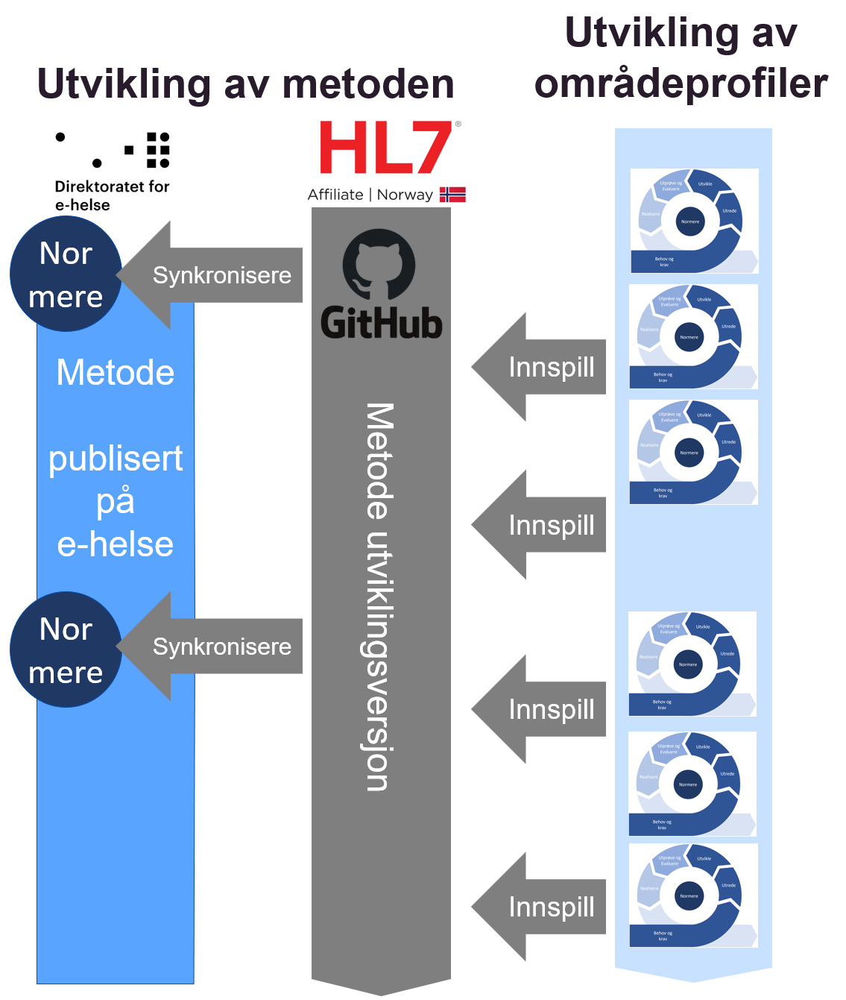

# Forvaltning av metoden

Metode for utvikling av områdeprofiler skal forvaltes og videreutvikles som et samarbeid mellom alle aktører i sektoren og forankres med HL7 Norge og Direktoratet for e-Helse gjennom en åpen prosess og via åpne kanaler slik det slås fast i [**Prinsipp 11**](no-national-profiles-principles.md).

Vedlikehold og forvaltning av metoden gjennomføres etter metode for utvikling av områdeprofiler. Det betyr at fasene metoden beskriver kan benyttes også i et forvaltningsløp for selve metoden. Ansvarlig forvalter er Direktoratet for e-helse, men hele sektoren må gi innspill til endringer etterhvert som de opparbeider seg erfaringer med bruk av metoden.

## Normert versjon og utviklingsversjon

Metoden er normert av Direktoratet for e-helse. Versjonen som er publisert på ehelse.no gjenspeiler den kvalitetssikrede og normative beskrivelsen av metoden.  

Samtidig vil det eksistere en utviklingsversjon av metoden på HL7 Norges GitHub (dette dokumentet). Den vil bli oppdatert løpende etter innspill fra sektor etter som man får erfaringer med bruk. Ved store forskjeller mellom normert versjon og utviklingsversjon vil endringene fra utviklingsversjonen bli inkludert i den normerte, og en revidert utgave vil bli publisert på ehelse.no.

**Figur** Forvaltning av metoden
