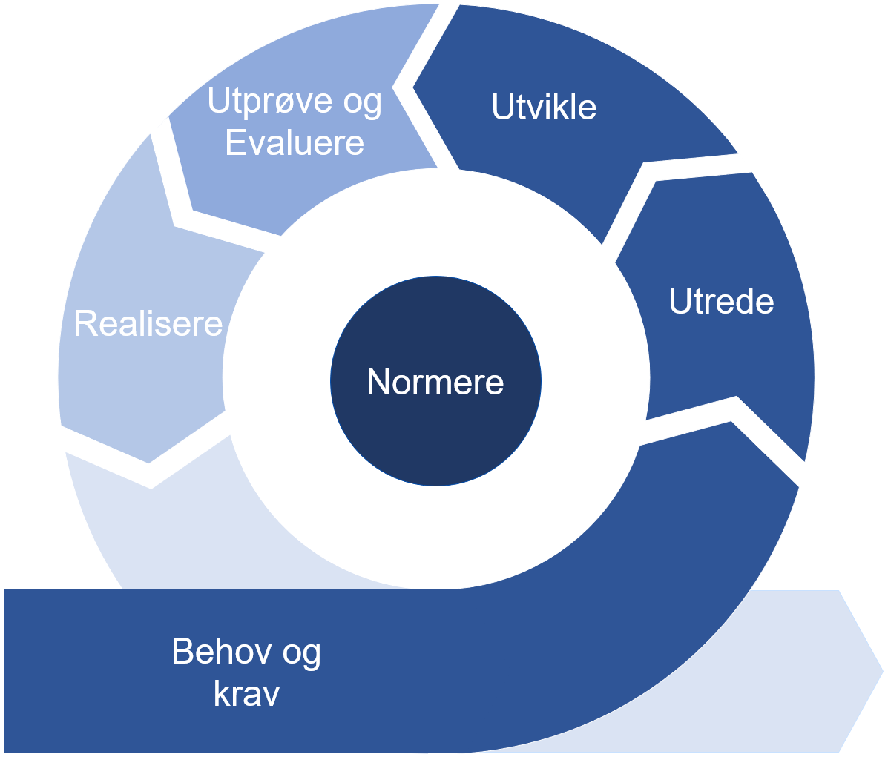

# Beskrivelse av utviklingsmetoden

Metoden benytter seg av faser som er beskrevet i [forvaltningsmodellen](https://ehelse.no/publikasjoner/forvaltningsmodell-for-normerende-produkter-fra-direktoratet-for-e-helse) og beskriver hvilke oppgaver som må gjennomføres i hver av fasene når områdeprofiler skal utvikles.
  

**Figur** Metode for utvikling av områdeprofiler

## Fasene i utviklingsmetoden

- [Behov og krav](behov-og-krav.md) - spesifisere krav som dekker behovene innen anvendelsesområdet

- [Utrede](utrede.md) - vurdere behovene og kravene identifisert i forrige fase med tanke på anvendelse, behov for gjenbruk og internasjonale spesifikasjoner

- [Utvikle](utvikle.md) - utvikle områdeprofilen i samarbeid med andre aktører i sektoren

- [Utprøve og evaluere](utprøve-og-evaluere.md) - kvalitetssikre områdeprofilen

- [Realisere](realisere.md) - gjøre det områdeprofilen tilgjengelig

- [Normere](normere.md) - beskrive hvilke deler av områdeprofilen som er normative

## Smidig utvikling av områdeprofiler  

Utviklingen av en områdeprofil vil ofte skje i sammenheng med utviklingen av programvare/tjeneste som skal løse et samhandlingsbehov. Utviklingsarbeidet vil være smidig, dvs. det vil foregå før, under og etter at hele eller deler av områdeprofilen er normert. Utvikling, test og driftssetting av programvareproduktet trenger ikke være en del av utviklingsprosjektet for områdeprofilen, men i mange tilfeller vil disse være tett sammenkoblet eller del av samme prosjekt.
