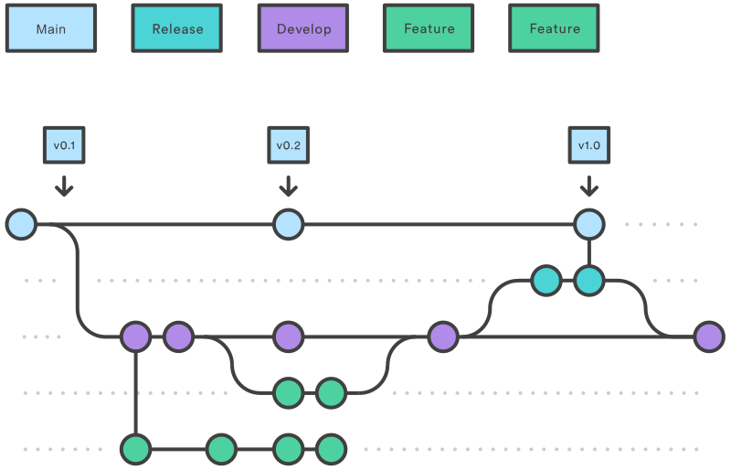

# Sjekkliste for endringer og tillegg i nasjonale profiler

Ved endringer i conformance ressurser så må sjekklisten gjennomgås.

## Arbeidsflyt

* Tillegg til nasjonale profiler utformes i egen branch på GitHub
* Det fastsettes versjonsnummer for releasen etter gjeldende regler
  * [IG versjoner](ig-versioning.md)
* Changelog oppdateres fortløpende med informasjon om hvilke filer som endres og hvorfor
* HL7 Norge vurderer om forslag kan merges til master for review på worshops og høringer
  * Alle conformance ressurser som skal til review må ha status = draft og skal ikke ha versjonsnummer

## Sjekksliste ved merge til master

Når feature branch er ferdig opprettes det pull request på GitHub, pull request skal gjennomgås av representanter fra minst to organisasjoner.

* Sjekk at endringslogg forklarer hva som er endret siden siste versjon
* Sjekk navngivning av conformanceressurser, det er retningslinjer både for navn, tittel, url og id elementene
* Det skal eksistere en forklarende description på alle Conformance ressurser som forklarer hvorfor ressursen skal brukes og hvilket problem den løser
* Alle endringer i elementer må forklares med et rasjonale om hvorfor endringen er gjort
  * Endringer knyttes fortrinnsvis til issues som er diskutert i HL7 og i utviklergruppa
  * Implementasjon av faktiske Issues skal som hovedregel godkjennes av HL7 TSK
* Alle elementer må ha en forklaring på hvordan bruken er forskjellig fra vanilla FHIR
* Conformance ressurser må valideres maskinelt både mot .NET validator og offisiell java validator
* Sjekk at det eksisterer eksempler som demonstrerer ny funksjonalitet og at de validerer mot oppdaterte profiler

## Opprette pakke

Når featurebranch er merget til master skal alle oppdaterte filer automatisk være tilgjengelige på SIMPLIFIER.net.

* FØR NY PAKKE OPPRETTES
  * Sjekk om det er oppstått duplikater på SIMPLIFIER av enkelte filer, dette kan ofte skje ved automatisk oppdatering mellom GitHub og SIMPLIFIER
* Opprett ny pakke med versjonsnummeret fra pull request'en som ble fastsatt i starten av prosessen
  * **Pakken skal kun inneholde ressurser med status=active**
* Legg inn oppsummering av endringene fra changelog i releasenote for den nye pakken

## Implementation Guide

* Oppdater versjonsnummer på ImplementationGuide
  * Skriv inn dagens dato for siste bugfix/endring
  * Beskriv hovedformålet med endringene i bugfix/endrings beskrivelsen
* Vurdere om det er behov for tillegg eller endringer i implementasjonsguide
  * Det SKAL som et minimum eksistere egne kapitler i en no-basis implementasjonsguide for profiler og extensions
* Sjekk om implementasjonsguiden må utvides med beskrivelse av nye brukstilfeller?
  
