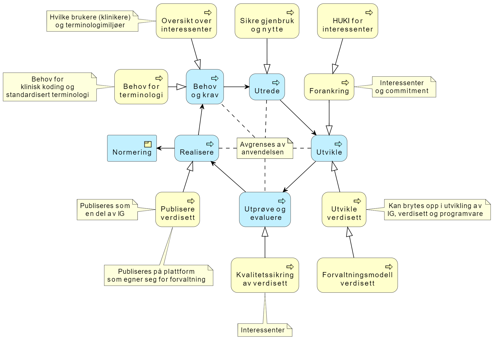

# Metode for terminologiarbeid i no-domain

Starte arbeidet med å utfylle beskrivelsen av og erfaringer med å utvikle vitale-parametere og spesifisere terminologi norske domeneprofiler.

## Eksisterende arbeid om terminologi

* En side i best-practice/profilering om [terminologibinding](terminologibinding.md)
* En publisert side om [kodeverk](codesystem.md)
* En publisert side om [prinsipper om kodeverk](prinsipper_kodeverk.md), lenket fra terminologibinding siden.

## Forslag: utvide metoden

**Utvide metode for områdeprofiler/domeneprofiler med et kapittel om terminologibinding og terminologiarbeid.**  

Terminologiarbeid er bare nevnt i en setning i metoden, men er den mest tidkrevende prosessen i profileringsarbeidet for vitale parametere. Det trengs oppsummering av erfaringer og beskrivelse av metode for å arbeide med og forankre terminologiarbeidet i forbindelse med domeneprofilene.  

* Sjekke at det ikke er overlapp med eksisterende sider på best-practice.
  * Det er noe overlapp mellom sidene vi har idag.
  * Fakta i best-practice sidene og metode for utvikling som en del av no-domain metoden.

## Målbilde terminologitjenester

## Vitale parametere erfaringer

* Det har tatt lang tid.
* Prosjektet hadde tidlig oversikt over behov for kontekstinformasjon, å få "normert" kodeverk og verdisett sammen med eksterne aktører (SNOMED miljøet) var "umulig".
* Å lage verdisett selv går fort, å forankre innholdet av verdisettene i de nasjonale miljøene kan ta årevis.
  * Prosjektet startet med arketype som utgangspunkt for verdisettene.
  * Etter flere år kom SNOMED miljøet i direktoratet på banen.  
  * Det ble gjort noen justeringer i verdisettene når SNOMED ekspertene hadde sett på forslaget til verdisettene.  
    * les: det kom verdifulle innspill til verdisettene når prossessen kom igang, men ventetiden på disse var svært lang.
* Det mangler en prosess som gjør det mulig å koble SNOMED/arketype fagmiljøene med de faktiske brukerne på klinikken.  
  * Prosjektet manglet comitment fra interessenter i SNOMED miljøet.
* Både DIPS og VKP har implementert API-grensesnitt.  
* Vi begynner så smått å få erfaringer fra VKP (Bodø er såvidt igang).  
* DIPS implementasjon av integrasjon mellom metavision og DIPS - ikke i drift.  
* Det er gjennomført flere iterasjoner med utvikling av verdisett og implementasjonsguide for no-domain-vital-signs.  
  * Det kan være verdifullt å bryte opp prosessen i egne iterasjoner som handler om IG utvikling, terminologiutvikling og løsningsutvikling.  
* Vi har hatt færre iterasjoner i forhold til utvikling av løsninger som benytter domenemodellen.  
* Erfaring med eksterne leverandører er at ingen vil implementere før ting er ferdig, det gjør det vanskelig å bruke smidig metode i utviklingen.
  * Hvordan klarer vi å få leverandørene med på smidig utvikling?
* Utvikling og forvaltning av verdisett har ikke noe "hjem", det er ingen som tar ansvar for dette nasjonalt.
* Utvikling og forvaltning av implementasjonsguider har ikke noe "hjem", det er ingen som tar ansvar for dette nasjonalt.
  * SPUN kan være avhjelpende tiltak i forhold til dette.
* Fremdeles et åpent spørsmål om VKP kan ta med seg justeringer i sine profiler basert på no-domain arbeidet.

### Terminologiarbeid i no-domain

**Forslag til metode for terminiologiutvikling i forbindelse med no-domain. Aka: Hvilke råd gir vi til neste prosjekt?**

* Start smått, tenk stort. Forsøke å forenkle brukerhistorien til noe som gir umiddelbar nytte for kliniker og pasient.
* Anvendelsen må beskrives (tydelig) først (ivaretatt i dagens metode).  
* Behov må analyseres og beskrives  
  * Få oversikt over interessenter.  
  * Husk å tenke på terminologibehov, hvilke verdisett og fra hvilke kodeverk.
* Det er viktig å få commitment fra terminologimiljøene.  
  * Være tydelig hva de ulike interessentene har for oppgaver og ansvar i arbeidet.  
* Utviklingen av verdisettene må henge sammen med anvendelsen.  
  * Det er viktig med god forankring av verdisettene som spesifiseres i de ulike terminologimiljøene, både nasjonalt og internasjonalt.  
  * Dette kan fungere som god avgrensning så prosjektet ikke utvikler mer enn det som er knyttet til den faktiske anvendelsen.  
  * Det kan være verdifullt å bryte opp prosessen i egne iterasjoner som handler om IG-utvikling, terminologiutvikling og løsnignsutvikling.
  * Utviklingen av verdisett må også vurdere forvaltningsmodell og ansvar for disse (ansvarlig forvalter). Kan peke på eksisterende forvaltere/forvaltningsmodeller.  
* Som en del av utprøvingen må også kvalitetssikringen av verdisettene settes i fokus.
  * Her må man bruke oversikten over interessenter og HUKI matrise fra forankringsfasen.  
  * Det er viktig å teste løsning og implementasjon av terminologi på faktiske brukere.
* Ved realisering av implementasjonsguide er en viktig oppgave publisering av verdisett.
  * Verdisett må publiseres ved hjelp av et eller noen få kildesystem for nasjonal eller lokal forvaltning av verdisett.  
  * Versjonen av verdisettet som benyttes i implementasjonsguide publiseres som en del av implementasjonsguiden.  
* I den grad verdisett skal normeres kan det være nyttig å fastslå modenhet og peke på forvaltningsprosess for relevante verdisett.  
